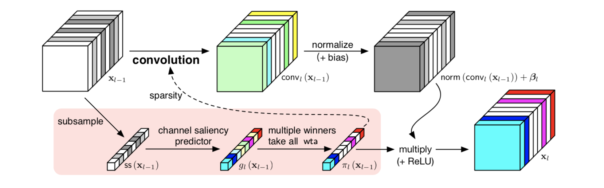
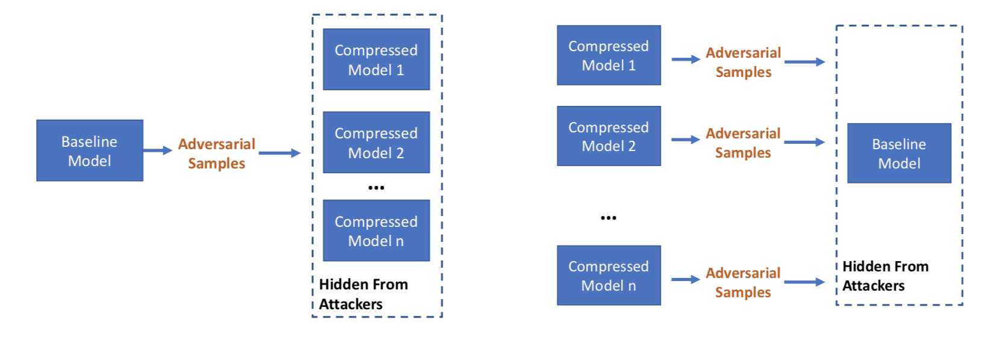
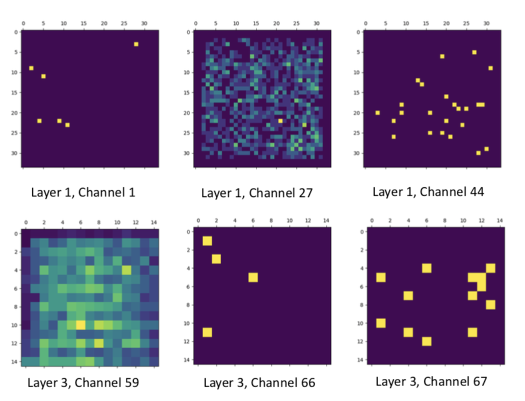
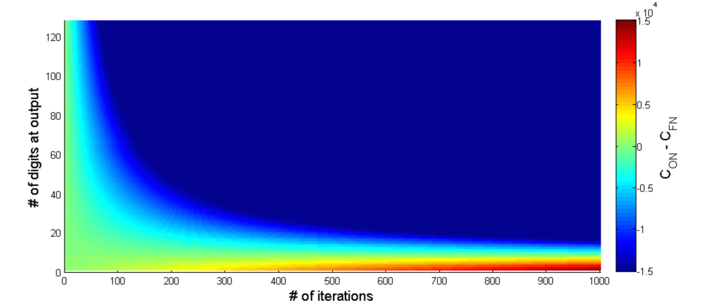

# Dynamic Channel Pruning

[paper link](https://arxiv.org/abs/1810.05331)
(Accepted in ICLR 2019)

We propose feature boosting and suppression (FBS) to dynamically amplify and suppress output channels computed by the convolutional layer in a CNN.

Intuitively, we can imagine that the flow of information of each output channel can be amplified or restricted under the control of a “valve”. This allows salient information to flow freely while we stop all information from unimportant channels and skip their computation. Unlike pruning statically, the valves use features from the previous layer to predict the saliency of output channels.

With conventional stochastic gradient descent (SGD) methods, the predictor can learn to adapt itself by observing the input and output features of the convolution operation.

# Mayo

[paper link](https://www.sigmobile.org/mobisys/2018/workshops/deepmobile18/papers/Mayo.pdf),
 [project link](https://github.com/deep-fry/mayo)
(Published in EMDL 2018, a workshop for MobiSys2018)

A framework for auto-generating hardware friendly deep neural networks.
In Mayo, we re-implemented a wide variety of compression methods and support combining these methods in an arbitrary order.
In addition, each layer can use different overriding functions.
The table compares Mayo to other similar frameworks.

Using Mayo, users can generate smaller models for the purporse of:

* trade off inference speed and accuracy
* slim large models on a smaller dataset with fewer labels
using transfer learning

# Compression means safe CNNs?

[paper link](https://arxiv.org/abs/1810.00208)

Many custom CNN accelerators nowadays use compression methods (pruning and quantization) to achieve better energy efficiency. We found that these compressed models stay in the same feature space as the original models and thus makes adversarial transferable between them.

The broader implications are that attacks on DNN classifiers that involve adversarial inputs may be surprisingly portable. Even if a firm ships only a compressed version of its classifier in widely distributed products, such as IoT devices or apps, attacks that people discover on these compressed classifiers may translate fairly easily to attacks on the underlying baseline model, and thus to other compressed versions of the same model. Just as software vulnerabilities such as Heartbleed and Spectre required the patching of many disparate systems, so also a new adversarial sample may defeat many classifiers of the same heritage. Firms should be aware that while shipping a compressed classifier may give real benefits in terms of performance, it may not provide much in the way of additional safety or security.

# The Taboo Trap

[paper link](https://arxiv.org/abs/1811.07375)

The Taboo Trap is a detection mechanisms that works against adversarial samples on CNNs.

We train our DNN so that, as long as it is working as intended on the kind of inputs we expect, its behavior is constrained, in that a set of behaviors are taboo. If it is exposed to adversarial samples, they will often cause a taboo behavior, which we can detect. As an analogy, we can imagine that we are teaching our robot good manners; if it’s ever rude, we know it’s come under some bad influence. This defence mechanism is very simple and, although it involves a modest increase in training, has almost zero computation overhead at runtime – making it particularly suitable for use in embed- ded systems.

# Online Arithmetic

[paper link](https://ieeexplore.ieee.org/document/7929191)
(Published in FPT2018)

Online arithmetic unifies arithmetic operations in an MSD (Most significant digit)-first fashion.
Classic serial online operators, although producing results in a digit-by-digit fashion, require precisions to be specified at design-time because they use parallel online adders on residue terms.

Our new design reuses a fixed-precision parallel adder and stores residues in on-chip RAM. This hardware reuse enables results to be produced with arbitrary precision but consumes only a fixed amount of computational hardware. For any given iterative algorithm with a known number of iterations, we could connect online operators and generate results to any precision at run-time with constant hardware costs, and the maximum achievable precision is only limited by the availability of on-chip RAM.

The figure shows the amount of clock cycles required to solve an iterative algorithm with the requirement of different precisions.

